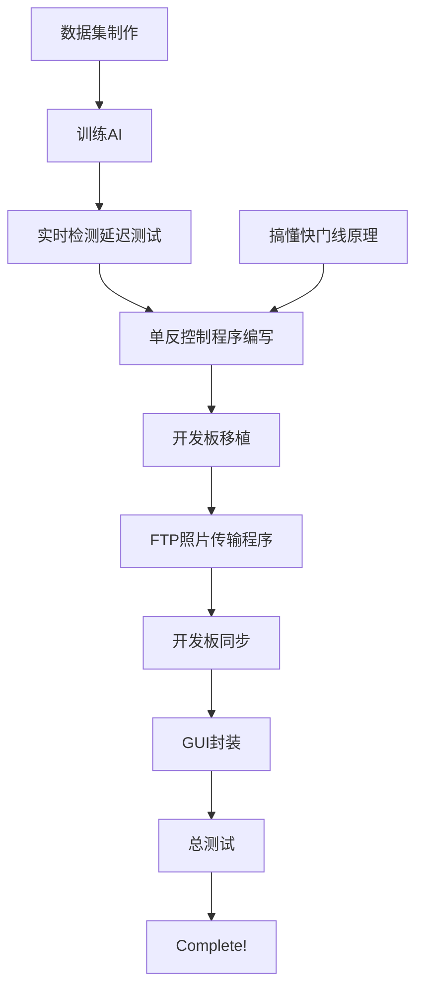

# Tennis In Out Bonds Detect

Use Yolo V5 to detect weather the tennis ball is in/out the bonds

## 一、所需材料、人手

1.两台单反照相机，需要快门速度（shutter speed）能达到1/8000s，能够实时传输拍摄的照片（通过USB或者WIFI或者蓝牙），连拍速度达到10Fps，能够通过快门线控制。

2.两块具有WIFI功能的开发板，能够运行Linux系统，并有USB/GPIO/Serial Port，用来控制单反连拍，进行图像预处理并打上时间戳。

3.需要一台具有GTX1650及以上性能显卡的电脑，用于实时监测判断

4.可能需要会电路设计、MCU设计的人（物联网系、机电系、自动控制系）

5.暂时没了

## 二、程序模块

### 1.单反控制模块

​		此模块需要通过快门线连接至单反相机，利用开发板上的GPIO接口或者Digitai接口来控制单反相机连拍。此模块需要具备快速网球运动检测能力，可能使用YOLO X进行开发（检测速度快）。单片机要能运行Linux系统，可以是RasperryPi/OrangePi这一类的，最好能是Jetson Nano这一类能支持CUDA加速的视觉运算开发板。

### 2.FTP上传服务器

## 三、开发流程

